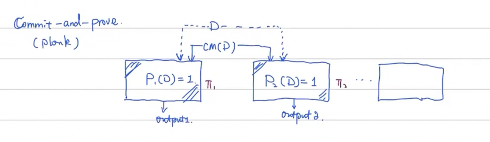

# Why ZKP?

零知识证明 Zero-knowledge Proofs

其中的 Proof($\pi$)  必须是个有用的：$Theorem / Statement / Proposition$

1. 不要把 Proof 这个词忘掉，到底证明了什么？
2. 两个角色，证明者（prover）、验证者（verifier），是双方的。写代码的时候要时刻关注写的到底是哪部分，是证明者的代码，还是验证者的代码。

$$
Prover  \rArr\pi\rArr Verifier
$$

**Prover Code**: 需要关注，有没有产生一个有效的证明，产生这个证明的时候有没有泄漏不该泄漏的信息。
**Verifier Code**：关注，这个证明是不是有效的。

> 写代码的时候容易忘掉。
> 这是一个 Two-party interaction

3. 关注以下三个性质：

* **完备性（Completeness）**：诚实的证明者（honest prover）一定能成功证明。
* **可靠性（Soundness）**：恶意的证明者（malicious prover）一定通不过验证。**很难测试，需要非常认真、仔细、深入的考虑这个问题：如何保证 verifier 不会被欺骗。**
* **零知识（Zero-knowledge）**：恶意的验证者（malicious verifier）无法获得有用的知识。

> 关注 Meta Theorems (Completeness and Soundness)的证明
> 如何保证我们写的 babyplonk 是 sound 的。

* Prover 和 Verifier 之间有大量的交互。Verifier 会发送大量的 challenge 给 Prover。challenge 越多，Proof Size 就越大。
* 交互过程中的步骤顺序不能调换。
* 实际项目中如果有安全漏洞是非常严重的。
* 攻击本身也可能是 ZK 的，不知道谁干的。

## Non-interactive

BlockChain 中经常使用 Non-interactive ZKP。 Fiat-Shamir Transformation 能把 public-coin protocol 转换成 non-interactive protocol。

> public-coin 指的是掷硬币，公开的发随机数 challenge。
> 借助 Random Oracle (RO) 工具来辅助 Prover 来产生这些硬币。随机数不一定是由 verifier 作为来源，由可信第三方来提供也可以。
> Prover 与 RO 交互，产生证明 $\pi$ 直接发送给 Verifier。不需要等待 Verifier 回复，Verifier 可以在未来异步验证这个证明。
> 通常使用一个足够安全的哈希函数（Cryptographic Hash Function）来替代 RO 的角色。没有严格的证明，大概率不会出问题。

## Commitment

1. $O(1)$ Size。无论数据多大，比如 10 GB 的文件，都可以产生一个很小的串来代表它。
2. Binding。$CM(D1)\not ={CM(D2)} \iff D1\not ={D2}$。
3. Hiding。能够保护数据，可以混入随机数。同一个文件两次 Commit 可以得到不同的 Commitment。

Blockchain： Put commitment on chain （EIP-4844，Rollup-blob）

## Commit-and-Prove

# Why zkSNARK
